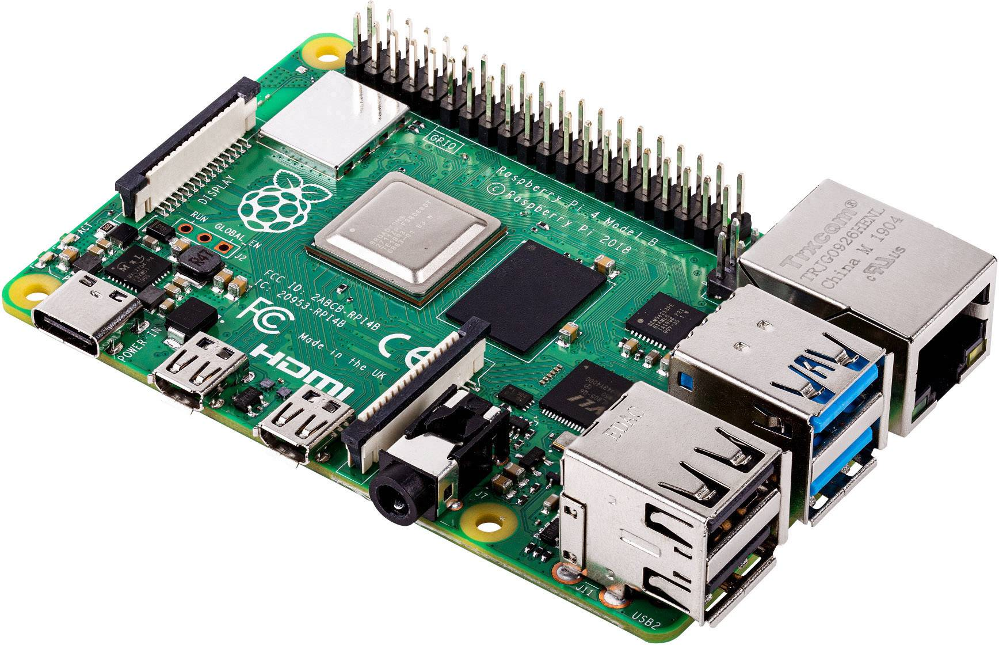

# ARM (Advanced RISC Machine)
---
Un'architettura per processori che utilizza un set ridotto e semplificato di istruzioni, detto RISC (Reduced Instruction Set Computer). 

La sua semplicità strutturale offre bassi consumi e alta efficienza, allo stesso tempo chip piccoli, economici e veloci. Questo è vantaggioso per smartphone, dispositivi [[IoT (Internet of Things)]], ma viene usata anche in server e computer vari.

Ricorda che ARM è anche il nome della società che sviluppa quest'architettura. Non produce direttamente CPU, ma vende le licenze di utilizzo ad altre aziende come Apple, Samsung, Qualcomm. 

---
[[CPU (Central Processing Unit)]]