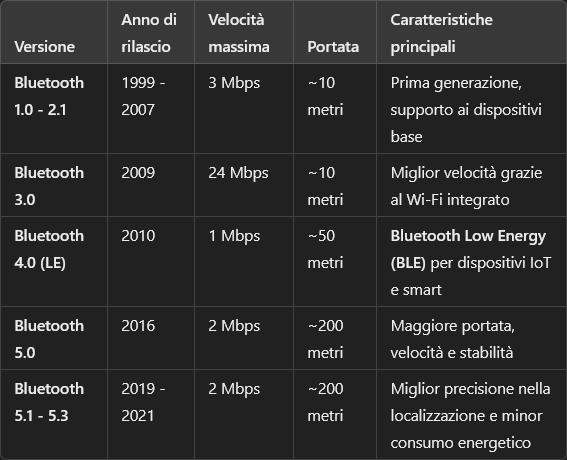

# Bluetooth
---
Una tecnologia di comunicazione wireless, permette a dispositivi diversi di connettersi tra loro per scambiare dati.

Nel funzionamento è molto simile allo standard [[IEEE 802.11]], ma la differenza sta nel fatto che crea una rete esclusiva ai due dispositivi connessi in quella che chiamiamo [[PAN (Personal Area Network)]]
###### **Classi e versioni del bluetooth* 

---
