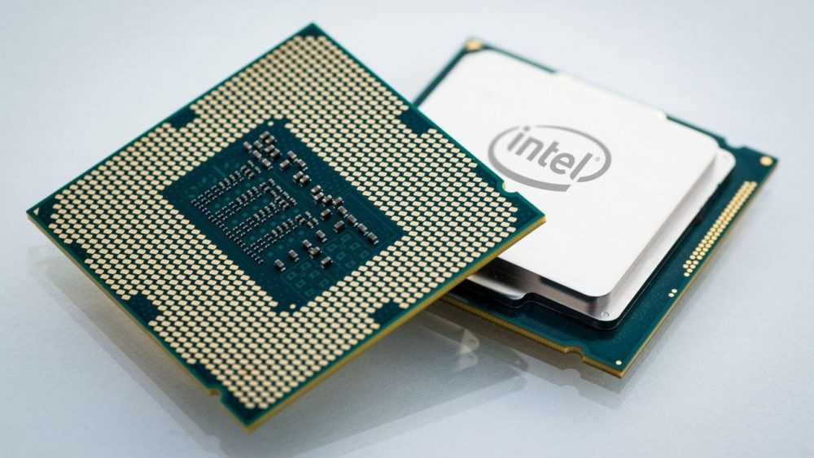
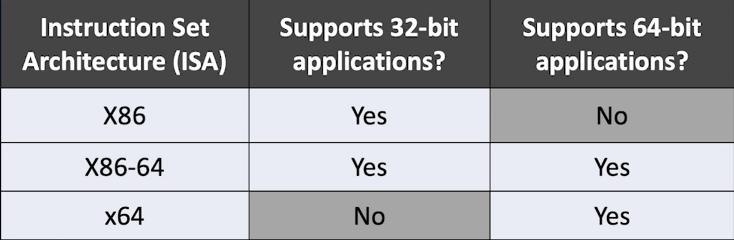
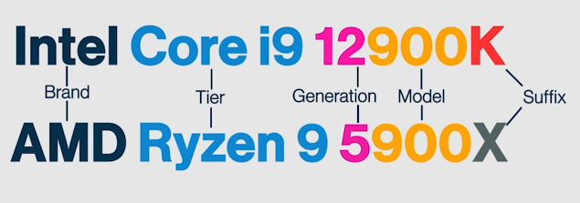

# CPU (Central Processing Unit)
---
Anche detta processore, è uno dei componenti di un computer; esegue istruzioni, calcoli e gestisce il flusso di dati a sistema.

#### **Come funziona?**
Immagina un uomo intelligente e veloce nei calcoli, che vive rinchiuso dentro una scatola chiamata **"CPU"**. Non possiamo parlargli direttamente, quindi comunichiamo tramite lampadine.

Dentro e fuori la scatola ci sono 8 lampadine ciascuna, chiamate **"bit"**. Quando ne uniamo 8 otteniamo un **"byte"**. Le lampadine si accendono (1) o si spengono (0), creando combinazioni che significano istruzioni diverse. Tutte queste istruzioni sono raccolte in un libro chiamato **"Machine Language"**, che l'uomo legge da una memoria esterna detta **RAM**.

L'uomo utilizza gruppi extra di lampadine chiamati **"registri"** per fare calcoli più complessi come sommare o moltiplicare. Ha anche una piccola memoria interna velocissima chiamata **"cache"**, che conserva temporaneamente le informazioni più usate, rendendo più veloce il lavoro.

Per coordinare tutto, l'uomo utilizza una specie di campanello chiamato **"clock"**: ogni volta che il clock suona, l'uomo inizia una nuova operazione. Il clock determina il ritmo con cui avvengono tutte le operazioni.

Nelle CPU moderne non c'è un solo uomo, ma molti uomini, ognuno chiamato **"core"**, che lavorano contemporaneamente e indipendentemente su operazioni diverse, formando una catena di montaggio parallela chiamata **"pipeline"**.

Per rendere più veloce la CPU si può aumentare la velocità del clock, aggiungere più core o migliorare l'organizzazione interna **(architettura)**, ed è quello che aziende come Intel e AMD fanno.

Adesso, al netto dell'esempio questi concetti nella pratica si traducono in:

- [[Bit]]

- [[Machine language]]

- [[RAM (Random Access Memory)]]

- **Registri:** piccole memorie molto veloci, si trovano dentro la CPU e servono a conservare i dati più immediati durante le operazioni.

- **Cache:** memoria interna molto veloce, conserva i dati frequentemente richiesti dalla CPU per migliorarne le prestazioni.

- **Clock**: frequenza periodica con il quale la CPU sincronizza e regola il ritmo delle operazioni. La velocità di clock si misura in Hertz, e un processore con velocità di clock 2 GHz riesce a elaborare 2 miliardi di cicli al secondo.

- **Core:** un'unità di calcolo interna alla CPU, più core permettono di eseguire più attività contemporaneamente; è come aggiungere una corsia all'autostrada per poterne smaltire il traffico più velocemente.

- **Pipeline:** sistema interno alla CPU, divide le istruzioni in fasi parallele in modo da migliorarne l'efficienza.

#### **CPU a 32 bit, e CPU a 64 bit**
Ogni processore individua informazioni all'interno della RAM utilizzando degli indirizzi numerici.

Per una CPU a 32 bit, ognuno di questi indirizzi è lungo 32 bit. Un bit può assumere solo due valori, quindi se ogni indirizzo fosse composto da 2 bit potremmo comporre 4 combinazioni diverse: 00, 01, 10, 11. Il numero di combinazioni possibili si ottiene elevando 2 alla potenza dei bit per ciascuna informazione. In questo caso, una CPU a 32 bit è in grado di individuare 2^32 indirizzi: 4.294.967.296 bit (4 miliardi), circa 4GB di RAM. Una CPU a 32 bit può gestire fino a 4GB di RAM, puoi dargliene di più ma lei leggerà sempre fino a 4GB.

Una CPU a 64 bit scavalca invece questo limite, perchè riesce a individuare 2^64 indirizzi: più di 18 trilioni in totale, che ti permette (se li avessi) di gestire 18 Exabyte di RAM, più di 4 bilioni di volte quello che una CPU a 32 bit può gestire.

Per concludere, questo termine indica la quantità di dati che un processore può gestire. Una CPU a 32 bit è una CPU che può gestire fino a 2^32 indirizzi in RAM; una CPU a 64 bit è una CPU che può gestire fino a 2^64 indirizzi in RAM.

Adesso, ci sono tre architetture CPU che riguardano questi concetti:

Come vedi, il nome dell'architettura che supporta le applicazioni a 32 bit è X86.
Al giorno d'oggi, la maggior parte degli applicativi viene prodotta per lavorare con CPU a 64 bit; alcuni sono però compatibili con la loro controparte a 32 bit, è anche per questo che Windows distingue i programmi in "Programmi" e "Programmi (x86)".

#### **La nomenclatura delle CPU commerciali**

---
[[ARM (Advanced RISC Machine)]]
[[APU (Accelerated Processing Unit)]]