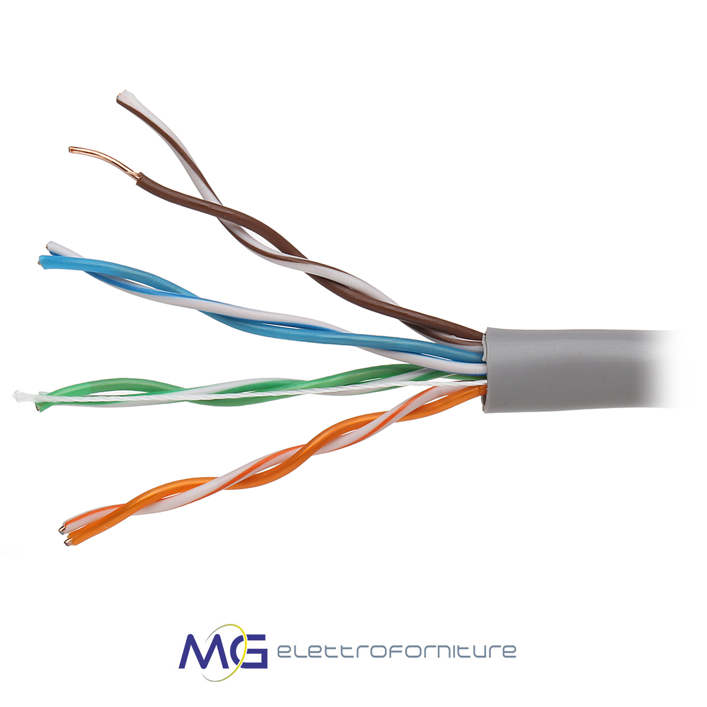
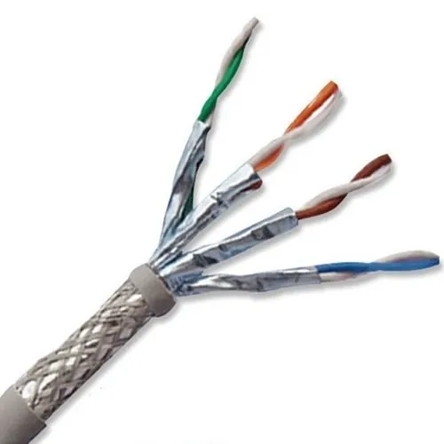
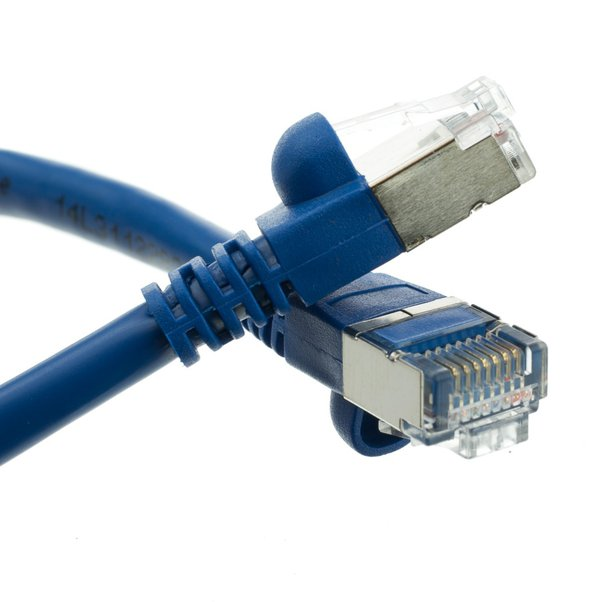
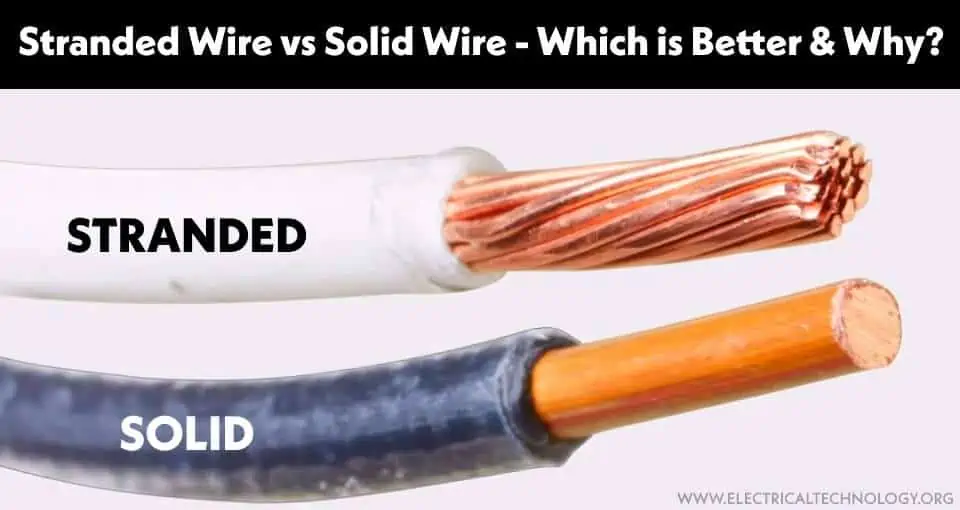
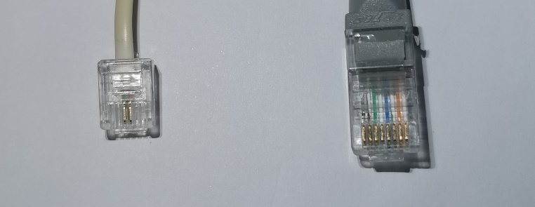
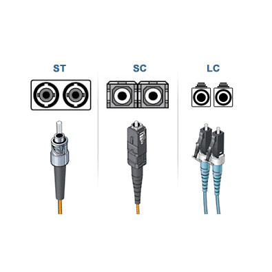
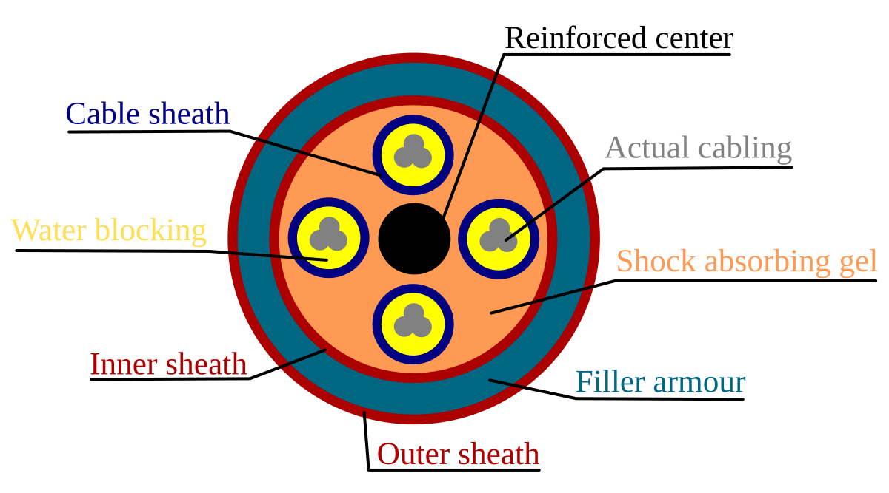

# Cavi e connettori nel networking
***
Lo standard [[Ethernet]] definisce standard di connessione alle reti, e per raggiungere determinate velocità (es. 100 mega al secondo, 1 giga al secondo etc.) bisogna munirsi di specifici cavi.

#### **Cavi twisted pair**
I cavi twisted pair hanno in gran parte sostituito i vecchi cavi coassiali nel networking oggi.

Questi cavi son formati da quattro coppie ("doppini") di fili in rame avvolti tra loro, questo ci permette di propagare un segnale migliore sulle lunghe distanze rispetto a quanto sarebbe possibile con un cavo dritto:

In questo cavo ciascun filo di rame è avvolto da una guaina, ma ci sono diversi tipi di cavo twisted pair:

- **Unshielded Twisted Pair (UTP):** questo tipo di cavo non è schermato, i fili di rame avvolti dalla guaina sono a loro volta racchiusi in una guaina esterna.
- **Shielded Twisted Pair (STP):** un cavo twisted pair ma schermato, in questo caso tra i fili di rame avvolti dalla guaina e l'esterno del cavo c'è uno strato intermedio di schermatura che lo protegge da interferenze di vario tipo. Vediamone una foto.
  
  

	Qui invece troviamo un connettore RJ-45 su un cavo shielded twisted pair, come vedi c'è uno strato di schermatura anche sul connettore:
	
	

Il rame all'interno di ciascun doppino può essere poi predisposto in maniera diversa a seconda del suo utilizzo:

- **Cavi stranded:** il rame all'interno dei cavettini viene scomposto in tanti fili, questo garantisce una maggior flessibilità e resistenza nei casi in cui il cavo venga mosso molto, come nel caso di un cavo Ethernet che arriva dalla presa muro a un PC.
  
- **Cavi solid core:** dentro al doppino c'è un filo duro e puro di rame, tutto d'un pezzo. Questo è utile nelle situazioni in cui il cavo si muove poco, è molto resistente e le probabilità che si rompa sono minori; un esempio potrebbe essere un cavo che da uno [[Switch]] passa attraverso i muri e arriva a un [[Patch panel]].
  
  
#### **Connettori per cavi twisted pair**

Ecco due connettori diversi:

- **RJ-11:** usato per i telefoni, è solitamente il connettore di quel cavo che parte della borchia del muro per arrivare al router ("il filo del telefono" in volgare). Questo cavo è piccolo e ha solo quattro punti di contatto, ma può essere abbia sei posizioni. 
  
- **RJ-45:** questo connettore non deve essere confuso con l'RJ-11, invece che essere utilizzato per la linea telefonica viene utilizzato per collegare dispositivi in una [[LAN (Local Area Network)]]. A differenza dell'RJ-11 questo connettore ha otto punti di contatto e non quattro.

#### **Cavi in fibra ottica**
I cavi in fibra ottica sfruttano la rifrazione della luce per propagare un segnale, la luce passa attraversa un piccolissimo tubicino in fibra di vetro; se vuoi saperne di più, fai riferimento a [questo video di Linus](https://www.youtube.com/watch?v=G1Ke-H8I1uk&pp=ugMICgJpdBABGAHKBRFsaW51cyBvcHRpYyBmaWJlcg%3D%3D).

Esistono due tipi: multi-modale e mono-modale (più sofisticata e costosa).

I cavi in fibra ottica hanno dei connettori che per forza di cose si suddividono in due tubicini (send e receive), questo perchè la luce riflessa non può viaggiare in direzione contraria a quella dal quale è partita:

#### **Cavi direct-burial (interrati)**
Cavi installati sotto terra, specificatamente progettati per resistere alle condizioni avverse del suolo.

***

I cavi ethernet vengono classificati tramite i [[CAT ratings]].

I cavi twisted pair seguono due diversi [[Configurazione dei cavi Ethernet]].