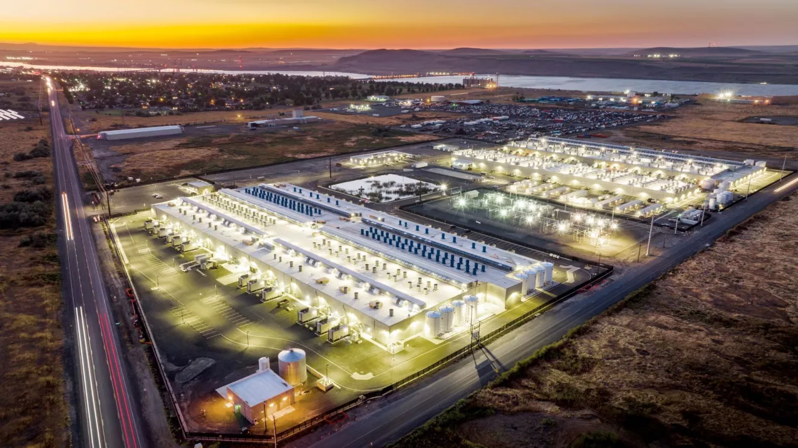

# Cloud computing
---
Volessimo dirla in termini ultra-semplicistici, il cloud è il computer di qualcun altro.

In questa frase:

- **"I computer"** non sono dei computer come il tuo portatile, ma una tra tante virtual machine ([[Virtualizzazione]]) presenti su uno tra tanti di questi enormi server super-prestanti all'interno di un gigantesco data center.
- **"Il qualcun altro"** è un'azienda ricchissima come Amazon, Google, Microsoft, IBM, Alibaba e così via.
  

#### **Ma perchè usare il computer di qualcun altro?**
Per vari motivi:
  
 - **On-demand**: la possibilità di aggiungere o rimuovere risorse cloud a piacimento. Ci sono dei momenti di carico o degli eventi periodici nel quale potresti aver bisogno di potenza di calcolo extra, e altri in cui pagare un costo maggiore non avrebbe senso; ecco, affidarti a un provider cloud ti permette di non dover sostenere i costi di un parco dispositivi ampio quando non ne hai bisogno.
 
 - **Elasticità rapida (rapid elasticity)**: come il concetto di on-demand ci permette di espandere le nostre risorse a piacimento, qui però aggiungiamo un livello di automazione: le nostre risorse si auto-espanderanno una volta raggiunta la soglia di carico che abbiamo definito; per fare un esempio, se una determinata situazione ci porta a occupare l'80% delle nostre risorse, allora il nostro provider cloud aumenterà automaticamente la quantità di risorse cloud allocate per quanto necessario.
   
- **Resource pooling (risorse condivise)**: affidare a ogni server più macchine virtuali è conveniente ed efficiente, così come è conveniente affidare a ogni data center più server; ci son molte risorse condivise: memorie, processori, spazio, raffreddamento, impianti di filtraggio.

- **Backup**: i provider cloud non hanno solo backup di ciò che sta su quei server, faranno un cazzo di backup dell'intero data center (nel senso che a distanza di chilometri ce ne sta uno uguale adibito alle stesse mansioni).

#### **I modelli di proprietà nel cloud**
Detta "cloud ownership" in inglese, fa riferimento ai modelli più comuni con il quale le persone prendono proprietà di macchine cloud:

- **Private cloud:** ambiente cloud riservato in maniera esclusiva a una singola azienda. Può trovarsi in sede o essere gestito esternamente da un provider. È il caso di una società bancaria che ospita server cloud nei propri datacenter per garantire la riservatezza dei dati. È sicuro e personalizzabile, ma costa molto e la gestione interna diventa più complessa.

- **Public cloud:** ambiente cloud gestito da provider esterno, che vende le proprie risorse informatiche a un grande bacino di organizzazioni; ogni azienda paga per le proprie macchine, ma con la consapevolezza che queste si trovano in un datacenter comune ad altri. È il caso di Netflix che utilizza AWS per offrire i propri servizi streaming globalmente; costi e manutenzione ridotti, ma meno controllo diretto e più rischi per la privacy.

- **Hybrid cloud:** un modello di proprietà che combina ambienti cloud privati e pubblici, a seconda dell'utilizzo. È il caso di un'azienda che usa il cloud privato per dati sensibili (es. un database finanziario) e il cloud pubblico per risorse meno critiche (es. siti web o applicazioni per gli utenti). È flessibile e controllabile, ma la gestione può esser complessa.

- **Community cloud:** ambiente cloud condiviso da più organizzazioni con le stesse regole di sicurezza e privacy. Potrebbe essere il caso di una serie di ospedali o università che decidono di pagare assieme un unico bacino di risorse. I costi sono condivisi, la sicurezza è buona, ma per forza di cose si personalizza meno e la proprietà è condivisa.
  

Il cloud computing ha dato vita a diversi modelli di servizi: [[IAAS, PAAS e SAAS]].

---
