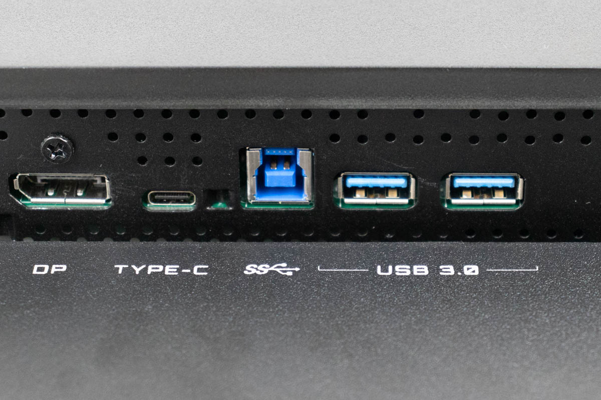

# Connettori upstream e downstream
***
I termini 'upstream' e 'downstream' fanno riferimento ai due connettori che troviamo su un cavo [[USB (Universal Serial Bus)]].

**Attenzione**: quando si parla di connettori upstream e downstream, facciamo riferimento a un cavo USB di tipo A o B; l'USB C non utilizza questi connettori, nel caso di un cavo USB C è il computer a determinare quale tra i due connettori sia upstream o downstream.

Su una delle due estremità del cavo troviamo il connettore A downstream, che riceve dati e comandi dall'host (da qui il termine downstream); se volessimo fare un esempio, collegare un mouse al PC permette al PC di inviare comandi al mouse per fargli capire cosa debba fare. 

All'altra estremità del cavo troviamo invece il connettore B upstream, che invia dati in direzione opposta all'estremità A; in questo modo, l'host può ricevere dati dal dispositivo.

L'estremità upstream di un cavo USB può essere saldata all'interno di un dispositivo (per esempio, un mouse) o avere una porta dedicata (per esempio, un hub USB o un monitor).

Ecco una porta upstream su un monitor:

***
