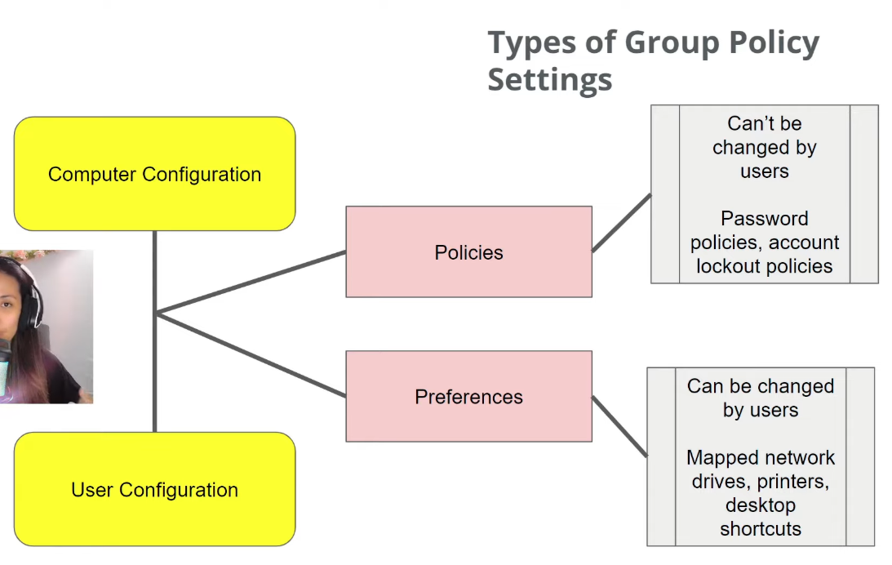

# GPO (Group Policy Object)
---
Un pacchetto centralizzato di impostazioni e configurazioni applicate a una serie di computer o utenti in Active Directory.

Possono contenere regole come: quali software installare, quali unità di rete mappare, quali restrizioni applicare etc.

#### **Computer o user policy?**
Le due macro-categorie principali di policy:

- **Computer:** usi policy a livello computer quando vuoi imporre regole sulla macchina intera, a prescindere da quale utente ci acceda; le policy computer vengono caricate prima dell'accesso utente, per esempio è utile l'esecuzione di un antivirus sia definita a livello computer in questo modo.
  
- **User:** usi policy a livello user quando vuoi che queste regole vengano applicate in maniera diversa su diversi utenti. Per esempio, potresti voler creare una policy che mappa automaticamente un disco di rete all'accesso di uno specifico utente.

#### **Policy o preference?**
Due sotto-categorie di configurazioni: le policy sono imposte dall'amministratore, le preferences sono scelte dall'amministratore nel loro valore di default, ma possono essere cambiate dall'utente (es. ho un disco di rete mappato, ma ne voglio aggiungere anche un altro).

---
