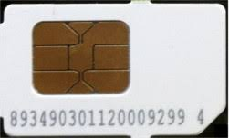

# ICCID (Integrated Circuit Card Identifier)
---
Un codice associato a ciascuna SIM cellulare, identifica in modo univoco la scheda fisica.

Lo trovi sulla superficie della SIM, una serie di piccoli numerini:

#### **Ma qual è la differenza tra IMSI, ICCID e IMEI?**
Qui c'è una tabella riassuntiva:

| Caratteristica | IMSI | ICCID | IMEI |
|---|---|---|---|
| Che cos'è | Identificativo unico dell'abbonato alla rete mobile | Identificativo unico della scheda SIM fisica | Identificativo unico del dispositivo mobile (hardware) |
| Formato | Numerico (15 cifre circa) Es: `222101234567890` | Numerico (19-20 cifre) Es: `8939101234567890123` | Numerico (15 cifre) Es: `356938035643809` |
| Dove si trova | Memorizzato nel chip della SIM (non stampato esternamente) | Stampato sulla scheda SIM e sulla confezione | Stampato sul telefono, confezione e visualizzabile digitando `*#06#` |
| A cosa serve | Autenticazione dell'abbonato alla rete mobile | Attivazione, gestione amministrativa, identificazione fisica della SIM | Blocco, identificazione e tracciamento del dispositivo mobile |
| Cosa identifica | Utente della rete | Scheda SIM fisica | Dispositivo (telefono/tablet/modem) |

---
[[IMSI (International Mobile Subscriber Identifier)]]
[[IMEI (International Mobile Equipment Identity)]]