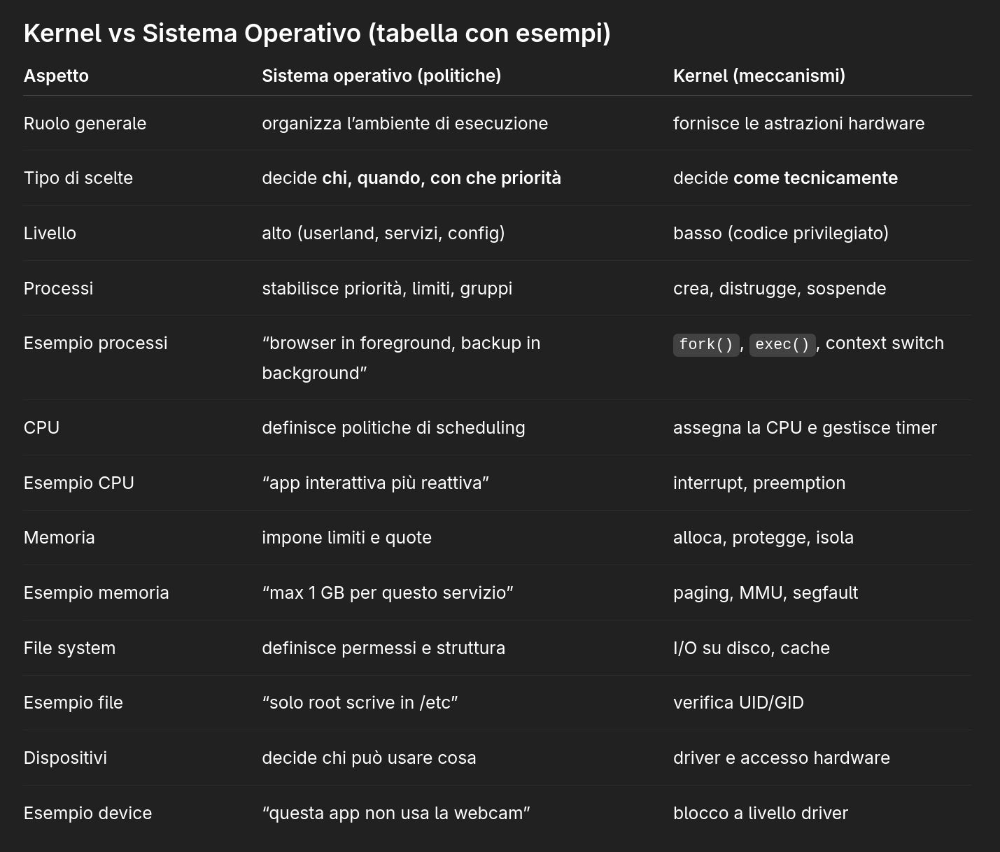

# Kernel
---
Il software che, per conto del [[Sistema operativo]], definisce i meccanismi fondamentali con cui i processi accedono alle risorse hardware.

### Ma che significa? non è la stessa cosa che fa il kernel?

Questa definizione qui è un po' astratta e potrebbe sembrare si sovrapponga con quella del kernel. È destinato ad essere così, perchè sia il kernel che il sistema operativo definiscono o regolano il modo in cui le risorse accedono all'hardware, ma a livello concettuale lo fanno in maniera diversa.

Quelle del sistema operativo sono politiche organizzative di alto livello, mentre quelli del kernel sono meccanismi tecnici più bassi.

Il sistema operativo (userland, servizi, configurazioni) stabilisce chi può fare cosa, con che priorità e in che ordine.

Il kernel invece esegue, sospende, isola, protegge processi usando l'hardware.

---
