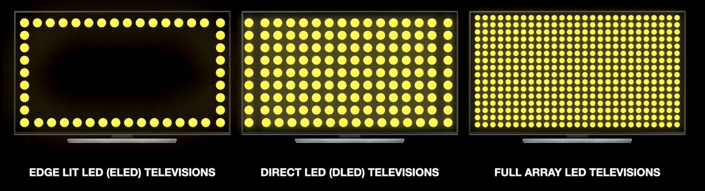

# LED (Light Emitting Diodes)
---
Un tipo di [[Backlightning]] utilizzato su monitor LCD.

È importante notare che quando si parla di "Monitor LED" stiamo parlando di monitor LCD con backlightning LED; i monitor LED sono un tipo di monitor LCD. 

Un monitor LED è composto da una trama di piccole celle che emettono luce, si tratta di una tecnologia più moderna rispetto al fluorescente; riesce a riprodurre i colori in maniera più accurata e ha un migliore rapporto di contrasto ([[Caratteristiche di un monitor]]).

#### **Tipi di monitor LED**
Diversi tipi di monitor LED, in base a disposizione, quantità e qualità delle celle illuminanti:

- **Edge-lit LED (ELED):** i diodi sono disposti sui bordi dello schermo, la luce viene poi propagata per tutto lo schermo da un diffusore. 
  
- **Direct-lit LED (DLED):** una trama di diodi diffusa lungo tutta la superficie del backlightning.
  
- **Full array LED:** concettualmente come il direct-lit, ma la trama di diodi è più fitta. Rispetto al direct-lit, neri più profondi e colori più realistici.
  
- **Organic LED (OLED):** nessun backlightning, ogni diode è in grado di emettere luce naturalmente. Neri perfetti e colori perfetti. Tutto perfettissimo.

---
[[Monitor e tipi di monitor]]
[[Caratteristiche di un monitor]]