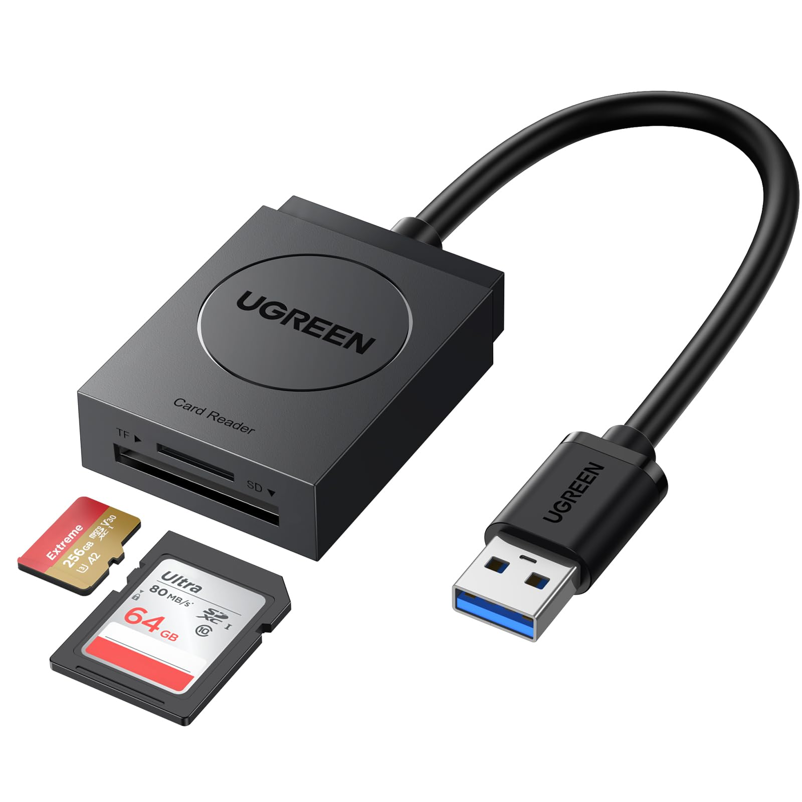

# Lettori di supporti elettronici
***
**Lettori di smart-card**: leggono una smart-card, possono essere usati per carte di credito, accesso ai PC, firme digitali e così via.

**Lettori di memorie flash**: leggono SD di diverse taglie, spesso un lettore di questo tipo è integrato su un PC.

***

