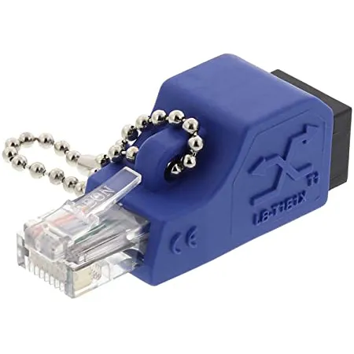

# Loopback plug
***
Un piccolo dispositivo utilizzato per testare o localizzare porte Ethernet su uno [[Switch]].

Al suo interno ci sta un circuito chiuso, come se un cavo uscisse e ritornasse da dove è partito al suo interno; il segnale viene quindi preso e rispedito da dove è partito.

Ecco uno scenario in cui ci è utile:

- **Localizzare un cavo ethernet**: ho un cavo ethernet collegato al mio PC, questo passa dentro al muro e arriva a uno switch con un sacco di altri cavi collegati. Vorrei solo sapere su quale porta va a finire il cavo ethernet che vedo attaccato al mio PC, come faccio? [Così.](https://www.youtube.com/watch?v=ghJ8YfGhfjs) Ma cosa succede se dall'altro lato non si accende nessuna lucina? succede che ci sta un problema o malfunzionamento da qualche parte, dovrai investigare.

***
[Altro video utile](https://www.youtube.com/watch?v=JOc94AXVZdA)
