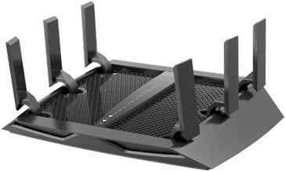

# MIMO (Multiple Input Multiple Output)
---
Una tecnologia usata all'interno delle reti wireless, migliora velocità, affidabilità e capacità delle connessioni. 

È stata introdotta con lo standard 802.11n ([[Versioni di standard Wi-Fi]]).

Utilizza tante antenne, sia sul trasmettitore (come un [[WAP (Wireless Access Point)]] o un [[SOHO router (Small Office Home Office)]]) che sul ricevitore (come un cellulare o un portatile) per inviare e ricevere dati allo stesso momento. In questo modo le trasmissioni diventano molto efficienti.

Questa tecnologia è nata inizialmente come SU-MIMO (Single-User MIMO) perchè i dati venivano trasmessi a un solo dispositivo per volta. Successivamente, è nato il MU-MIMO (Multi-User MIMO) che permette al trasmettitore di inviare dati a più dispositivi nello stesso momento.

---
