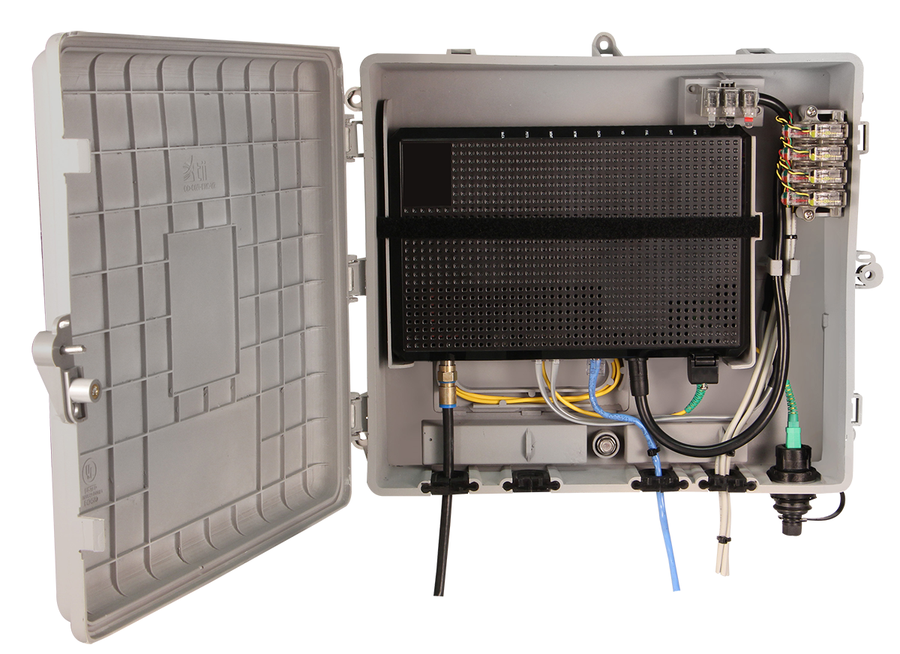
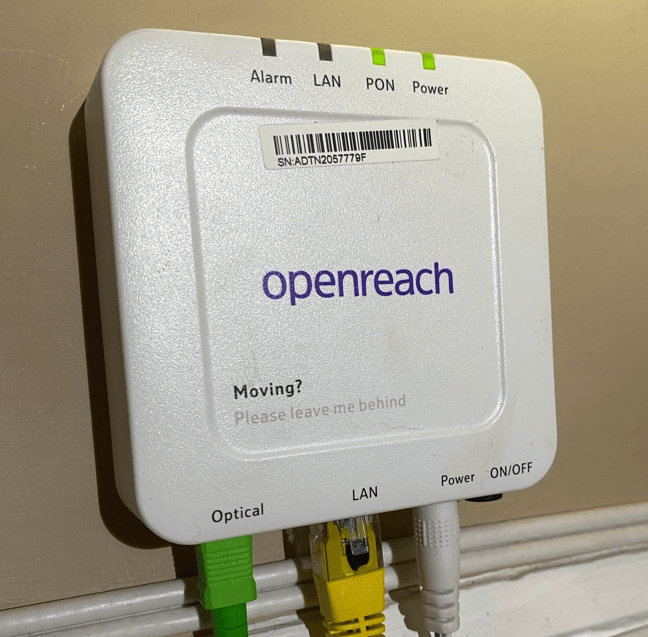

# ONT (Optical Network Terminal)
---
Un dispositivo utilizzato nelle connessioni in [[Fibra Ottica]], converte il segnale ottico della fibra in un segnale digitale utilizzabile da un router o da un computer.

Nel caso delle linee [[FTTC (Fiber To The Cabinet)]] è un armadietto esterno, tipo questo:

Nel caso delle linee [[Fibra ottica FTTH (Fiber To The Home)]] sta in casa invece, assomiglia a questo:

---
