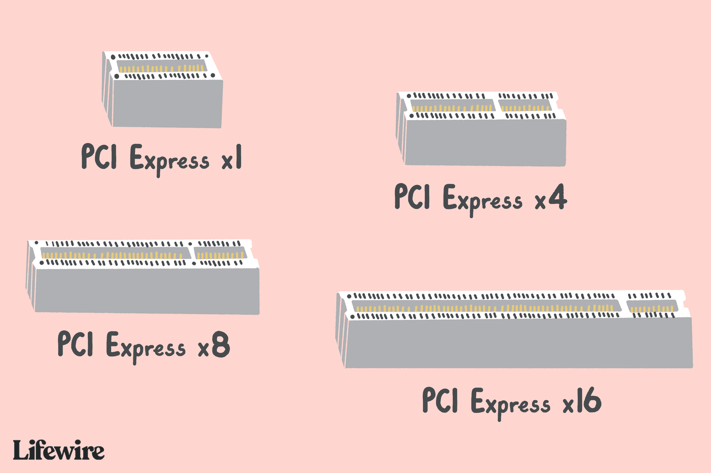

# PCI (Peripheral Component Interconnect)
***
Uno standard bus sviluppato per connettere periferiche a una scheda madre.

Lo standard PCI è diverso dallo standard PCI Express, e non sono retrocompatibili; ecco una foto che evidenzia la differenza tra i due:

Il PCI Express a sua volte viene suddiviso in più versioni: X1, X4, X8 E X16; proprio come su un'autostrada, maggiore è il numero di corsie maggiore sarà la scorrevolezza del traffico.

Per esempio, le schede video vengono collegate a uno slot PCIe x16.

***

