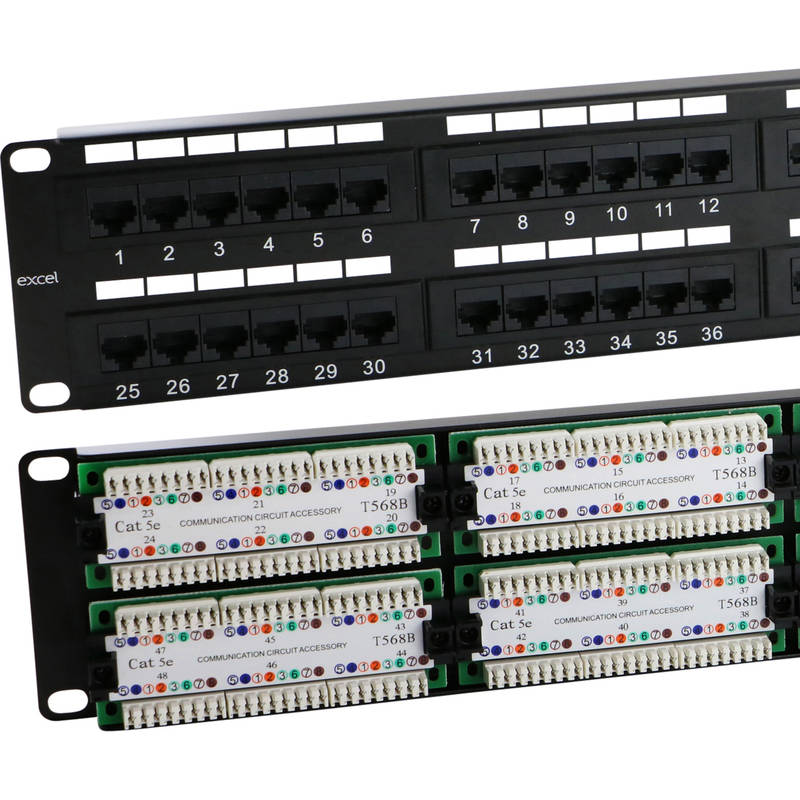

# Patch panel
***
Un patch panel è un dispositivo passivo usato per organizzare e connettere cavi all'interno di reti informatiche ([[LAN (Local Area Network)]]).

Visivamente è un pannello con davanti una serie di prese RJ45 e dietro una sezione dedicata al cablaggio di cavi Ethernet ([[Cavi e connettori nel networking]]). 

##### **Perchè un patch panel?**
Mettiamo di avere un locale a nostra disposizione, ci son due stanze: un salotto e una camera da letto. Ho bisogno di portar rete in casa e di collegarla al PC che sta nella mia camera da letto, quindi:

- mi munisco di modem router dal mio gestore telefonico e lo piazzo in salotto.
- buco un condotto attraverso le mura, monto una presa RJ45 dall'altro lato del muro (lo si fa per bellezza ma anche per funzionalità) e passo un cavo da modem router a presa RJ45 interna al muro.
- Tiro un cavo dalla presa a muro, fino al mio PC.
  
  

Semplice, no? questa cosa va bene per il mio PC a casa, ma immagina riproporre lo stesso scenario in un'azienda o un locale con 30 PC. In questo caso, dovrei far arrivare un sacco di cavi ethernet al mio PC, assomiglierebbe a questo:

Non è carino certo, ma funziona. Però c'è un problema: cosa succede se uno dei miei PC non raggiunge più internet perchè uno dei cavi è difettoso? sarebbe davvero difficile identificare il cavo difettoso in questo groviglio infernale.

Qui ci viene in aiuto un **patch panel**: 

- al retro del patch panel arrivano i cavi Ethernet, ma non con dei connettori RJ45 (ci sono però dei patch panel che utilizzano questo tipo di sistema); i connettori vengono infatti rimossi e i singoli cavetti in ciascun doppino di rame vengono inseriti (o punzonati?) all'interno della maschera dietro il patch panel, tramite uno strumento chiamato punzonatrice o pinza crimpatrice. Qui ogni cavetto deve seguire il relativo diagramma indicato per comporre lo standard di cablaggio ([[Configurazione dei cavi Ethernet]]).
  
  - sul frontale del patch panel vengono invece tirati dei patch cables dal patch panel allo switch; sopra ogni porta del patch panel verrà scritto un numero o un nome per identificare meglio il dispositivo al quale è connessa.

Un patch panel viene chiamato "passivo" perchè di per sè si occupa solo di collegare hardware di vario tipo, ma non ha alcun tipo di ruolo intelligente in tutto ciò (a differenza di uno [[Switch]]).

I cavi che passano attraverso il muro devono essere particolarmente resistenti, per questo vengono usati dei cavi Ethernet solid core e non stranded. ([[Cavi e connettori nel networking]])

##### **Ma come faccio a verificare che tutto funzioni e sia ben collegato?**
Ci sono degli strumenti appositi: 

- tester che verificano la continuità del cavo collegato.
- localizzatori che ci aiutano a capire dove un cavo Ethernet su presa a muro vada a finire sul patch panel.
- tester che ci aiutano a capire quanto sia lungo il cavo, in modo da capire se si abbia un cavo rotto nel muro.

***
https://www.youtube.com/watch?v=FfQui0mk85Q&pp=ugMICgJpdBABGAHKBQxwYXRjaCBwYW5lbCA%3D

https://www.youtube.com/watch?v=lg2oGE02DJE

