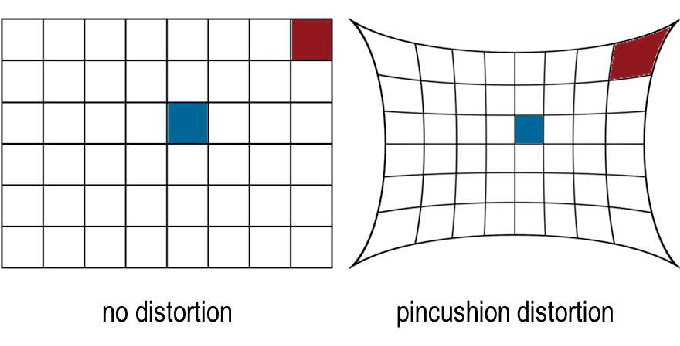
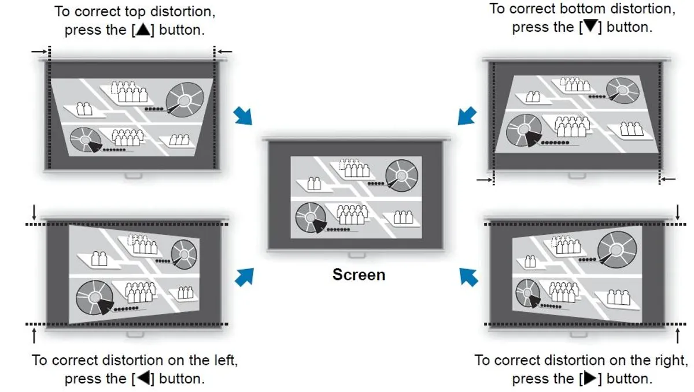
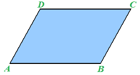

# Proiettore
***
Un proiettore è un tipo di [[Monitor e tipi di monitor]] che ci permette di proiettare un'immagine su un oggetto, un proiettore si collega al nostro PC tramite un cavo video (come si farebbe con uno schermo quindi).

Nello scegliere un proiettore dobbiamo tenere conto di:

- **Throw (tiro)**: la distanza tra il proiettore e l'immagine proiettata; non sarebbe possibile usare un proiettore dal tiro corto per proiettare un'immagine su un campo da calcio.
- **Fonte della luce**: esistono proiettori con lampade che vanno cambiate periodicamente, oppure esistono proiettore LED o laser che non hanno bisogno di manutenzione e hanno una resa luminosa sempre costante nel tempo.
- **Luminosità**: misurata in lumens, ci serve valutarla in base al tipo di stanza in cui ci serve proiettare le nostre

Installando un proiettore, ci accorgeremo che l'immagine proiettata non sarà perfettamente inquadrata e allineata al primo colpo, a causa delle cosiddette distorsioni dell'immagine proiettata; vediamo alcuni tipi di distorsione:

- **Pincushion**: immagine risucchiata, come un cuscinetto da spilli.

- **Keystone**: immagine trapezoidale, la parte superiore è più larga o stretta della parte inferiore.

- **Skew**: l'immagine viene proiettata a mo' di parallelogramma.

##### **Manutenzione dei proiettori**
I proiettori a volte danno problemi, sono dispositivi che hanno bisogno di molto spazio interno per evitare di surriscaldarsi; ci sono dei casi in cui la polvere blocca il flusso d'aria del proiettore non permettendogli di funzionare correttamente, bisognerà pulirlo.

Ogni tanto le lampade dei proiettori van sostituite.
***

