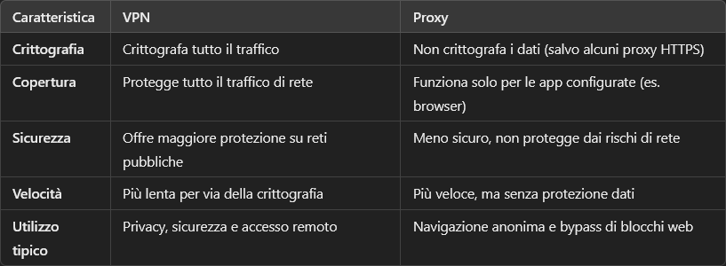

# Proxy
---
Un server che fa da intermediario tra il tuo dispositivo e il server finale dal quale hai bisogno di reperire risorse.

Quando il tuo client invia una richiesta, il server proxy la riceve e la inoltra al server come fosse partita dal proxy e non da te. Una volta ricevuta la risposta, la restituisce al tuo client. È un middle-man, come se stessi facendo spedire una lettera a un'altra persona per conto tuo in modo da nascondere la tua identità.

#### **Perché è utile usarlo?**
È utile in tanti modi, ma principalmente:

- **Protegge la tua privacy:** nasconde il tuo indirizzo IP, tutto viene veicolato dall'indirizzo IP del server proxy. Questo tipo di cosa ti aiuta anche a bypassare blocchi regionali ai contenuti.
  
- **Migliora la velocità di navigazione e riduce la banda utilizzata:** un proxy può essere configurato per recuperare un sito o una risorsa e immagazzinarla in un database come cache, questo ti permette di raggiungere il sito in minor tempo e utilizzando meno banda.

- **Traccia il traffico:** puoi monitorare il traffico che passa dal proxy, a fini di monitoraggio; da lì potresti far cose tipo bloccare l'accesso a determinate categorie di contenuti.

#### **Come lo uso?**
Puoi configurarlo da applicazione, oppure da Windows stesso. Prendi l'esempio di un proxy HTTP: se lo configuri da applicazione (quindi un browser), il traffico passerà dal proxy solo mentre utilizzi quel browser, mentre se lo configuri da Windows puoi fare in modo che tutto il traffico per uno specifico protocollo (es. HTTP, HTTPS, FTP e altro) passi dal protocollo specificato, oppure specificare indirizzi IP che sono esclusi da questa regola (cerca quale siano questi casi). Cercati un tutorial Youtube su come farlo per Windows, se ti serve.

Vuoi sapere cosa succede se dimentichi di aggiornare le impostazioni sul tuo proxy? un cazzo, una madonna di niente. È per questo che puoi configurare il [[Firewall]] sul tuo [[Router]] in modo da bloccare tutto il traffico in uscita sulla porta 80, a meno che non arrivi dal proxy.

#### **In che modo è diverso da una VPN?**
Un proxy potrebbe sembrarti uguale a una [[VPN (Virtual Private Network)]], perchè entrambi fanno da intermediario tra te e [[Internet]]; in realtà sono diversi:

Una VPN è ideale per proteggere totalmente la tua connessione con un tunnel, mentre un proxy è utile per navigare con IP diverso in modo semplice e veloce.  Le due cose hanno anche costi diversi, ne sai poco adesso e se vuoi puoi informarti. Comunque può capitare che un'azienda usi entrambi le tecnologie: proxy per ottimizzazione e filtro, VPN per sicurezza e connessioni remote alla rete aziendale.

---
[What is a Proxy Server?](https://www.youtube.com/watch?v=5cPIukqXe5w)