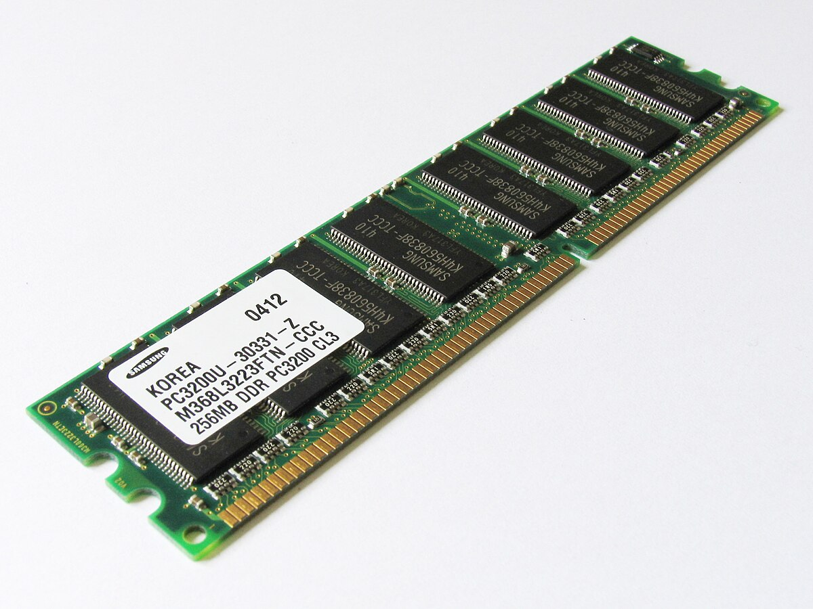
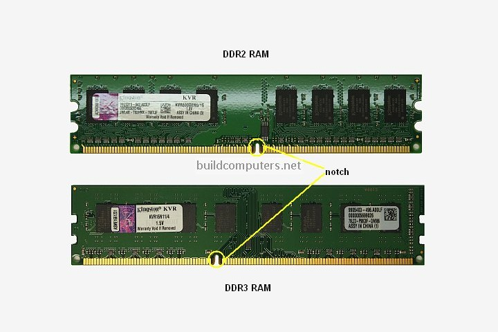
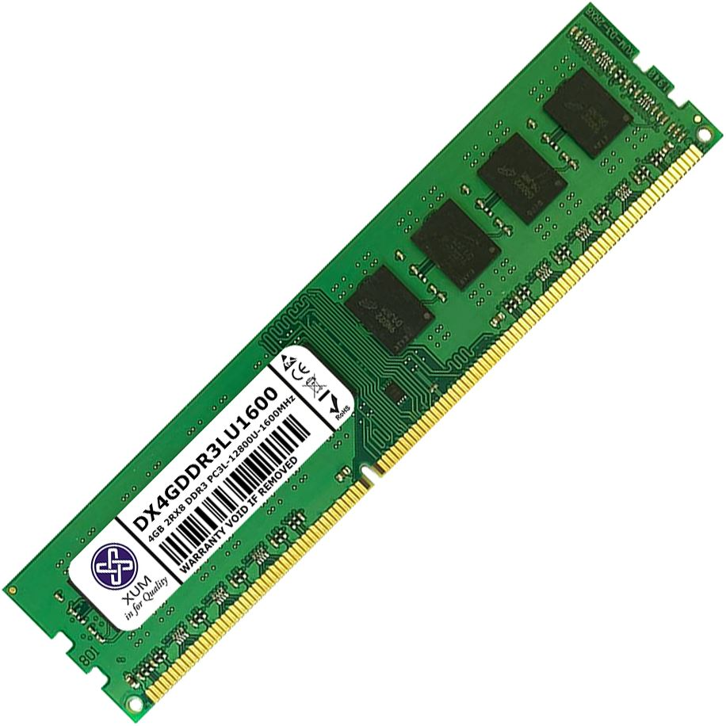
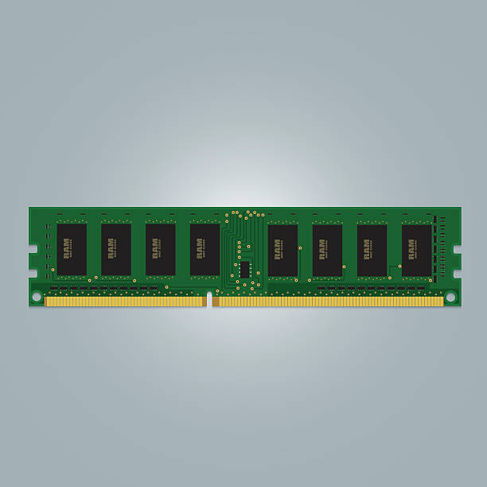
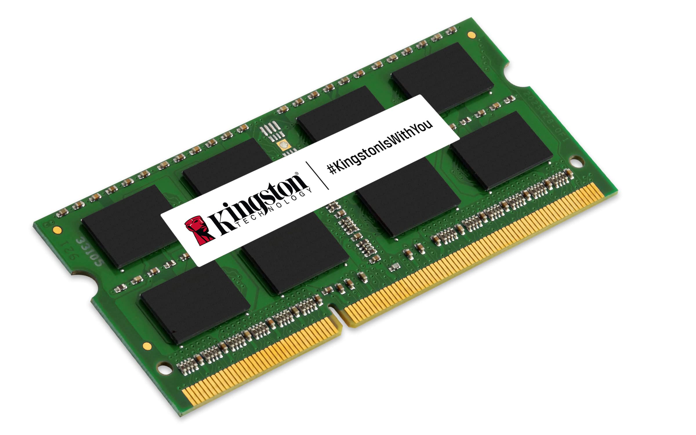
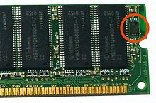

# RAM (Random Access Memory)
---
Una delle memorie del computer, conserva temporaneamente dati e istruzioni a breve termine necessari alle elaborazioni della [[CPU (Central Processing Unit)]].

#### **SDRAM (Synchronous Dynamic Random Access Memory)**
Uno dei primi tipi di RAM utilizzati, è stata introdotta nel 1988. 

Si chiama "Synchronous" perchè è una memoria progettata per funzionare in sincronia con il clock del processore: rispettando lo stesso ritmo, il processore sa esattamente quando dovrà chiedere un'informazione alla memoria, e viceversa la memoria sa quando dovrà renderla disponibile. 

Questo tipo di RAM può però trasferire dati solo una volta per ciclo, detta fase crescente del ciclo.

#### **DDR-SDRAM (Double Data Rate-Synchronous Dynamic Random Access Memory)**
Un evoluzione tecnologica rispetto alla SDRAM originale.

Questo tipo di RAM è in grado di trasferire dati due volte per ciclo, uno durante la fase crescente e uno durante la fase calante, raddoppiando la velocità di comunicazione con la CPU. Per fare un esempio pratico, immagina il battito del cuore: la DDR-SDRAM può trasferire dati sia al battito in sè, che tra un battito e l'altro. 

Uno stick di DDR-SDRAM ha 184 pin.

#### **DDR2-SDRAM**
Più veloce rispetto alla DDR-SDRAM. Il numero di pin aumenta, arriva a 240.

#### **DDR3-SDRAM**
Più veloce rispetto alla DDR2-SDRAM. Il numero di pin rimane 240, ma la scalanatura (o tacca) sullo stick è posizionata diversamente.

#### **DDR4-SDRAM**
Più veloce rispetto alla DDR3-SDRAM. 

#### **DDR5-SDRAM**
Più veloce rispetto alla DDR4-SDRAM. 

#### **DDR rating e PC rating**
La RAM va acquistata in funzione della velocità di clock indicata dalla tua scheda madre. Nell'acquistare della RAM troverai diversi indici che ti serve conoscere. :

- **DDR rating:** è la frequenza effettiva della RAM, la frequenza con il quale trasferisce dati; si misura in MHz e assomiglia a "DDR-200" oppure a "DDR4-3200", per il primo valore il 200 sta per 200 MHz. Nel caso della RAM DDR1, questo valore si calcola moltiplicando la velocità clock della scheda madre per due, perchè la RAM trasmette dati due volte per ogni ciclo dettato dalla CPU. Nel caso della RAM DDR2 devi moltiplicare quel valore di clock per due in modo da arrivare al DDR rating del DDR1, e poi moltiplicarlo di nuovo per raggiungere il DDR rating della DDR2. 

- **PC rating:** misura la larghezza di banda teorica, ovvero la quantità massima di dati trasferibili dalla RAM in un secondo; si misura in MB/s, e per ottenerla partendo dal DDR rating ti basta moltiplicare quel valore per otto. Si moltiplica per otto perchè non fai altro che trasformare i bytes trasferiti in bits. Per fare un esempio, dovessi trasformare il DDR rating "DDR2-400" in PC rating diverrebbe "PC2-3200".

- **Bandwith:** questo indice si è diffuso con l'avvento delle DDR4-SDRAM, come il DDR rating misura la velocità con il quale la RAM trasferisce dati, ma lo fa in MT/s (MegaTransfers per second). Una memoria DDR4 con un clock di 800 MHz effettua 1600 trasferimenti per secondo, ovvero frequenza moltiplicata per i trasferimenti per ciclo (che sono due).

#### **La capacità della RAM**
Ogni modulo di RAM ha una certa capacità, questa memoria viene immagazzinata in un chip quadrato all'interno del modulo che vedi:

Mettiamo di avere un modulo con un chip quadrato da 256 mb di capienza: il modo in cui i produttori fabbricano questi moduli li porta a creare dei quadrati, ma se raddoppi ogni lato del quadrato allora la sua area sarà quadruplicata; questo è il motivo per cui aumentare la memoria di un modulo da 256 mb lo porterà a raggiungere i 1024 mb, se ogni lato misurava 16 unità e adesso ne misura 32, la sua area sarà passata da 16x16=256 a 32x32=1024.

Attenzione però, questo è il caso in cui un modulo abbia i chip di memoria solo su un lato, detto single-sided. Esistono dei moduli di memoria che invece distribuiscono questi chip su due lati (double-sided), e in questo caso i chip raddoppiano la propria memoria e non la quadruplicano (256mb diventa 512mb).

Di tutto questo, l'importante è verificare che la scheda madre supporti il tipo di RAM che si sta utilizzando, single-sided e double-sided.

#### **Single channel e dual channel**
Ogni scheda madre ha un determinato numero di slot dedicati alla RAM, ma disporre i moduli in determinati modi influenza il modo in cui la RAM parla con il processore:

- **Single channel:** la RAM utilizza un singolo canale per trasmettere dati al processore, la banda è limitata e le prestazioni sono inferiori.
  
- **Double channel:** due moduli di RAM vengono disposti su due canali diversi, ma possono lavorare in parallelo, raddoppiando la velocità di trasferimento dati e migliorando le prestazioni su applicativi che richiedono memoria intensiva (gaming, editing, multitasking).
  
Il manuale di istruzioni della tua RAM ti guiderà nel disporre correttamente i moduli per raggiungere il dual channel, ma i due moduli dovranno avere stessa capacità, frequenza e latenza.

Adesso, nulla ti vieta di utilizzare 40 GB di RAM sul tuo PC, così disposti: 16 GB e 16 GB in dual channel, 4 GB e 4 GB in dual channel. In questo modo però, la differenza tra capacità e velocità dei moduli potrebbe ridurne le prestazioni, quindi è sempre consigliato utilizzare 4 moduli uguali in capacità e frequenza.

#### **Parity e RAM ECC (Error Correction Code)**
Ogni modulo di RAM ha in genere otto chip di memoria:

Vedi? sono otto, ma non è sempre così: alcuni moduli di RAM hanno un chip in più; questo chip viene chiamato "parity", e quello che fa è rilevare errori di memoria (bit flip causati da interferenze elettromagnetiche o difetti hardware) che abbiano guastato uno degli altri chip. Con questo tipo di tecnologia, avrai il tempo di sostituire il banco di RAM in quegli ambienti che richiedono alta affidabilità, come i server aziendali. 

Questa tecnologia è stata ormai sorpassata dalla RAM ECC, che ti permette non solo di rilevare errori di memoria, ma di correggerli nei casi minori. Inoltre, in questo caso la tua RAM sarà funzionante anche nel caso in cui si siano guastati due chip.

La tua scheda madre dovrà supportare questi tipi di tecnologia.

#### **RAM SO-DIMM (Small Outline - Dual Inline Memory Module)**
Sono moduli di RAM piccolini, si usano in cose come i portatili.

#### **Chip SPD (Serial Presence Detect)**
Un piccolo chip che vedi a occhio nudo su ogni modulo di RAM:

Questo chip permette al tuo sistema di interrogare il modulo di RAM, per ottenere informazioni su capacità, frequenza, produttore, latenza, anno di produzione e tanto altro. Puoi farlo con programmi tipo CPU-Z.

#### **Memoria virtuale/paging file/swap file**
Una tecnologia che permette al tuo sistema di simulare uno spazio di RAM, ma sul tuo [[HDD (Hardisk)]] o [[SSD (Solid State Drive)]]. Si utilizza per prevenire crash vari ed errori "out of memory" nel momento in cui esaurisci la capacità della tua RAM.

Il tuo sistema tratta una parte del tuo hardisk come fosse RAM, ma questa è una soluzione temporanea e dovrebbe servirti solo per pensare "ho bisogno di chiudere qualche applicazione, oppure devo aggiungere altra RAM"; la memoria virtuale è lenta, il tuo processore ci accede in maniera lenta rispetto alla RAM fisica.

Windows in genere ne definisce automaticamente la dimensione, ma puoi configurarla manualmente dovessi volerlo fare per qualche bizzarro motivo.

---
