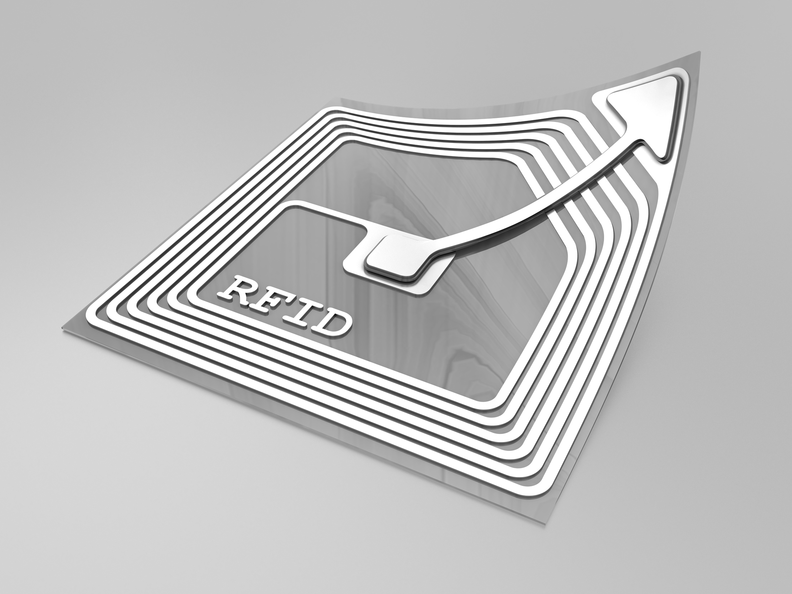
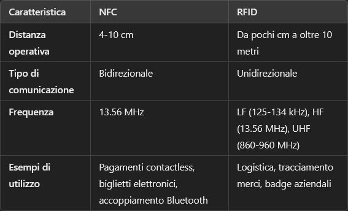

# RFID (Radio Frequency Identification)
---
Una delle tante tecnologie per comunicazione wireless (come il [[Wi-Fi]]), usa le onde radio per trasmettere e ricevere dati a distanza ravvicinata.

### Come funziona?
Hai bisogno di un lettore e un tag RFID (detto [[Transponder]]), che fisicamente è un piccolo sticker da apporre sugli oggetti:

Quando punti il lettore contro lo sticker, quello riceve una piccolissima quantità di energia, grazie al quale è poi in grado di ritrasmettere indietro dei dati tramite onde radio. 

Questo tipo di tecnologia è utile in logistica, controllo accessi, pedaggi, magazzini (per esempio metti uno sticker su un cassone, lo leggi e scopri che dentro ci sono 30 tubetti di dentifricio).

###### **Che differenza c'è con i dispositivi NFC?** 
La tecnologia di base è la stessa, entrambi si basano sui [[Transponder]], ma i dispositivi [[NFC (Near Field Communication)]] non funzionano in coppie trasponder - radio, lì entrambi i membri della coppia possono essere indipendentemente alimentati (come cellulare - POS, per esempio).

Ci sono poi delle differenze in segnale e sicurezza:

---
