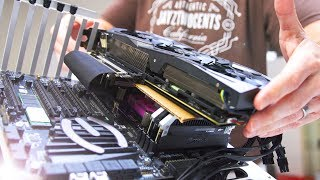

# Riser cards
***
Le riser cards sono dei cavetti di estensione che ci permettono di espandere lo spazio disponibile o modificare l'orientamento di componenti [[PCI (Peripheral Component Interconnect)]] all'interno di un computer. 

Per esempio: una riser card con un'estremità PCIe 1x e un'estremità PCIe 16x potrebbe permetterci di aggiungere al nostro sistema una seconda scheda video, o di montarla in un orientamento particolare; potrebbe anche servirci per montare un'altra scheda di rete etc.

***

