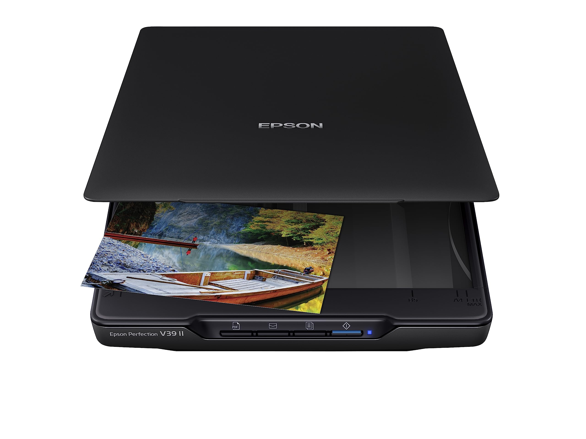
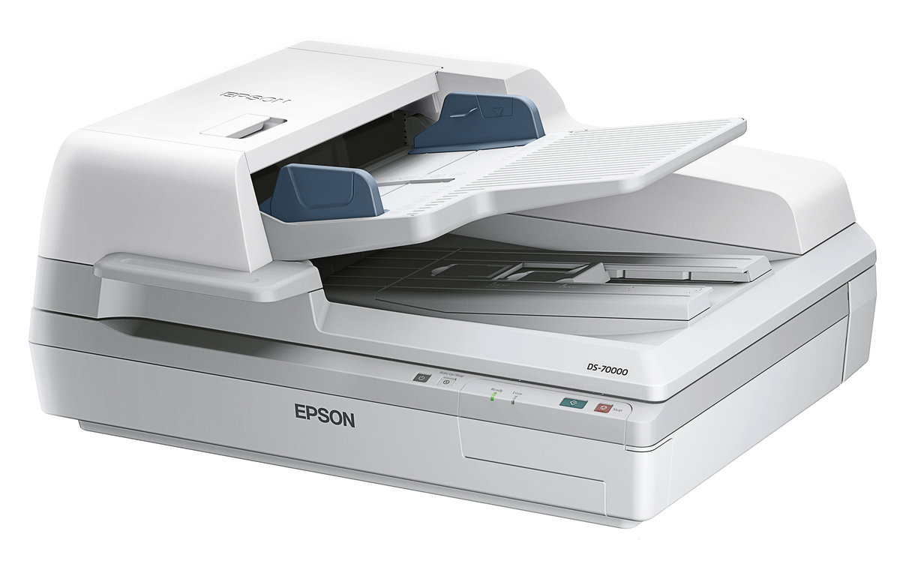

# Scanners
***
Gli scanner sono dispositivi elettronici pensati per digitalizzare documenti di vario tipo.

Ne esistono di vari tipi, vediamone due:

### **Scanner piani

### **Scanner con ADF (Automatic Document Feeder)**

***

