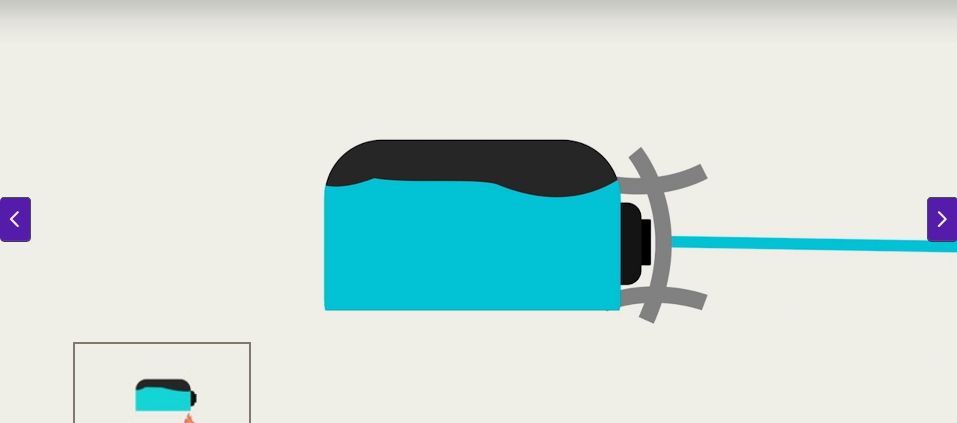

# Stampante a getto di inchiostro (Inkjet)
---
Un tipo di stampante, che come il nome suggerisce utilizza dei getti di inchiostro per riprodurre immagini o testo su un foglio di carta.

#### **Come funziona?**
1. Dentro la stampante trovi le vaschette di toner, che contengono l'inchiostro. Dipende dalla stampante, ma possono essere collegate con un tubo a un recipiente più piccolo, oppure avere direttamente dei beccucci rivolti verso l'esterno. 

2. Ciascun contenitore è attaccato a una testina di stampa, che si muove orizzontalmente e verticalmente lungo la superficie di stampa.

3. Il contenitore d'inchiostro viene riscaldato. Il calore provoca la fuoriuscita di inchiostro, spruzzato dai centinaia di ugelli che trovi sulla testina. Le gocce vengono create tramite bolle, o tramite cristalli che vibrano, a seconda del tipo di tecnologia utilizzata dalla stampante.

4. Il getto d'inchiostro che fuoriesce ha una certa carica elettrica, ed è questo il motivo per il quale trovi delle piccole sponde metalliche attorno al beccuccio: possono direzionare il getto della stampante.
   

5. La testina si muove lungo tutto il foglio, seguono le fasi di asciugatura. La testina torna alla sua posizione iniziale, detta "di manutenzione"

6. La stampante ti caca fuori il foglio.

#### **La manutenzione**
Queste stampanti, a differenza della [[Stampante laser]] hanno bisogno di tanto amore:

- **L'inchiostro sugli ugelli si può seccare:** se le tue stampe sono incomplete o manca qualcosa, è probabilmente dovuto a dell'inchiostro secco. Succede, ma la stampante può occuparsene tramite delle specifiche funzioni che puoi attivare dal menù di manutenzione; quello che fa è scaldare più del solito la punta del beccuccio, e spruzzare l'inchiostro incastrato.

- **Allineamento delle testine:** se sul foglio vedi stampe sfocate, righe irregolari e lettere sovrapposte, allora devi riallineare le testine. Ogni colore ha la sua testina, in genere sono vicine ma può essere perdano di poco la loro posizione. Puoi risolvere tramite l'apposita funzione di allineamento testine che trovi nel menù manutenzione.

- **Calibrazione colori:** se i colori stampati ti appaiono sbagliati, troppo scuri, troppo chiari o sbiaditi, allora ti tocca ricalibrare i colori dal menù manutenzione. Ogni tanto la stampante può regolare male la quantità di inchiostro erogata dalla testina di ciascun colore. 

---
[[Stampante a impatto]]
[[Stampante termica]]