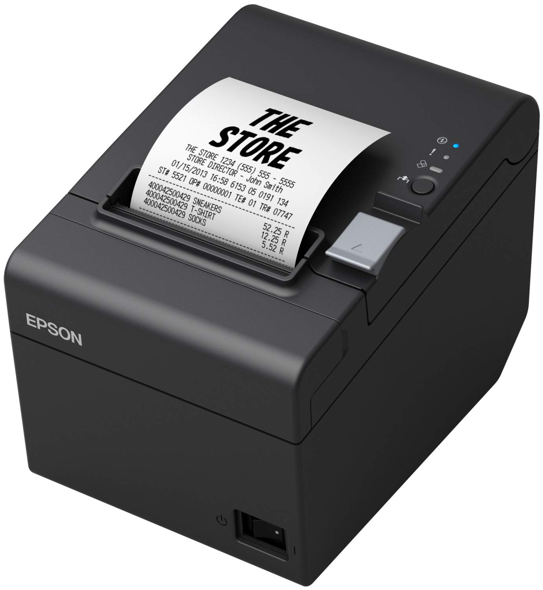

# Stampante termica
---
Piccole stampanti che utilizzano il calore per produrre testo su un foglio di carta. Queste stampantine stampano scontrini, adesivi, etichette e piccole fatture. 

#### **Come funzionano?**
Con il calore, ma non utilizzano inchiostro. Il foglio sul quale viene prodotta l'immagine è sensibile al calore (carta termica), e una serie di minuscole testine riscaldate ci imprimono lettere e segni. Proprio in virtù di questo funzionamento non si utilizzano per stampe che devono durare nel tempo: il calore esterno può danneggiare le stampe.

#### **Manutenzione**
I rotolini si cambiano spesso, sono piccoli perchè produrne di più grandi potrebbe riscaldare eccessivamente la carta termica; è anche per questo che vedi le cassiere cambiare rotolini ogni due per tre.

Una volta ogni paio di mesi dovrai aprire la stampantina e pulirla, la carta termica produce un sacco di foligine e polvere; in caso di problemi con le stampe, puoi pulire con un panno le testine che pressano il foglio.

---
[[Stampante laser]]
[[Stampante termica]]
[[Stampante a getto di inchiostro (Inkjet)]]