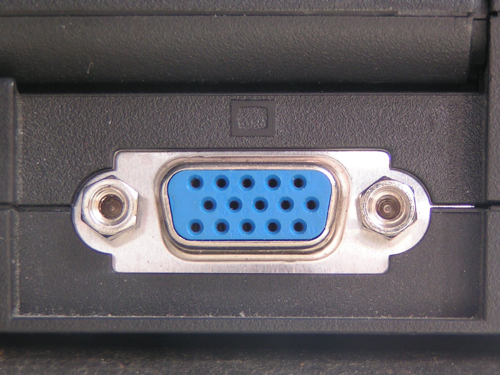
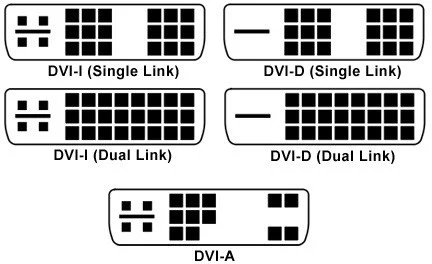
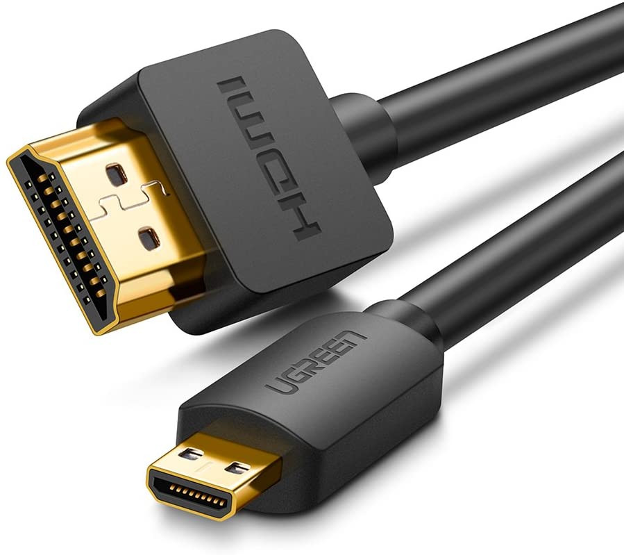
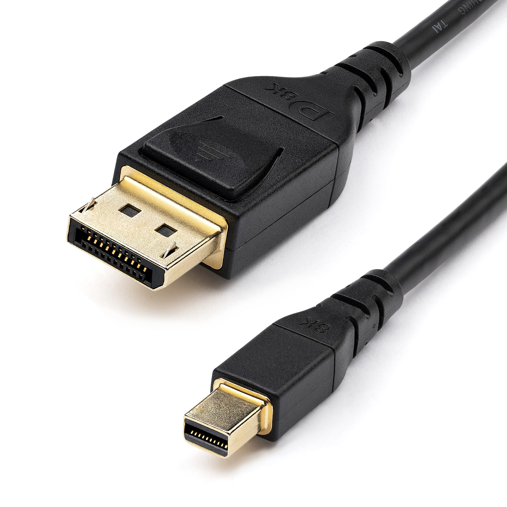

# Standard di connessione video
***
Quello che connette una [[GPU (Graphics Processing Unit)]] allo schermo di un computer ([[Monitor e tipi di monitor]]).

Esistono diversi standard di connessione video, vediamone un paio:

##### **VGA (Video Graphics Array)**
Questo standard di connessione risale al 1987, trasmette un segnale analogico e gestisce risoluzioni limitate. I monitor utilizzano un segnale digitale, quindi un monitor avrà bisogno di convertire il segnale analogico ricevuto prima di poterlo utilizzare.

##### **DVI (Digital Visual Interface)**
Il primo connettore video digitale inventato, si son succedute diverse versioni:

- **DVI-I**: il passaggio da analogico a digitale fu lento, molte persone utilizzavano ancora connessioni analogiche (VGA), il primo connettore DVI garantiva un segnale digitale quando connesso 'out of the box' e un segnale analogico se utilizzato con un adattatore VGA.

- **DVI-D**: questo cavo trasmette solo segnale digitale, a differenza del DVI-D; connettere un cavo DVI-D a un'uscita DVI-I non è fisicamente possibile, le due forme non combaciano.

- **DVI-I e DVI-D (single link e dual link)**: il dual link è stato pensato per trasmettere segnale a due monitor tramite un singolo cavo, il single link gestisce un unico monitor.

##### **HDMI (High Definition Multimedia Interface)**
Questo standard è in grado di trasmettere segnale video digitale e anche il suono, è molto popolare nei sistemi home-theater anche oggi. Qui una foto di un connettore HDMI e un micro-HDMI:

##### **DP (Display Port)**
Si occupa di trasmettere solo video, è un attuale competitor allo standard HDMI. Mike Meyers parla poco di questi standard, servirà poco sapere tutto il mumbo-jumbo a riguardo nel caso dell'esame Comptia; ad ogni modo, ecco una foto di un connettore DP e un micro-DP:

Le schede video hanno tante porte diverse per ridondanza, in modo da esser compatibili con tanti monitor.
***

