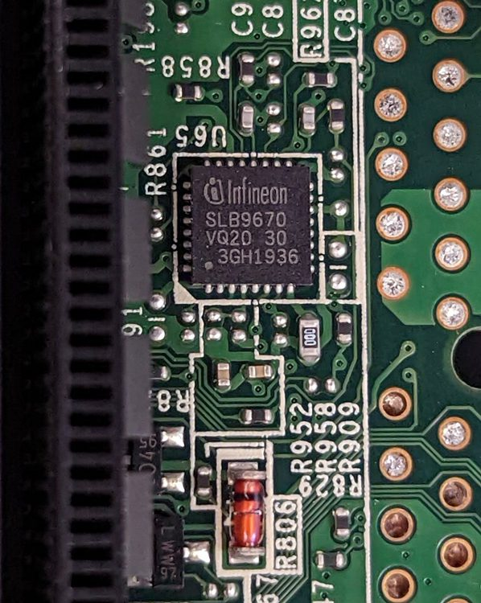

# TPM (Trusted Platform Module)
***
Un piccolo chip di sicurezza che rafforza il funzionamento della [[Crittografia di un disco]].

Può essere esterno o integrato su scheda madre, il chip ha una piccola memoria inaccessibile dall'esterno che custodisce le chiavi di crittografia e le rilascia solo se nessuno dei componenti critici del sistema (firmware, bootloader, secure boot) è stato modificato.

Un tentativo di manomissione può assumere diverse forme in base al tipo di attacco:

- **Ti rubo l'SSD e lo collego al mio PC:** al mio PC manca il TPM originale sopra, quindi il disco rimane cifrato e mi viene chiesta la recovery key.
  
- **Ti installo un bootloader modificato per intercettare la password di sblocco [[Bitlocker]]:** in assenza di TPM accedere al Bitlocker richiede una qualche forma di autenticazione pre-boot (tipo una password o una chiavetta USB). Un bootloader modificato può intercettare questa password (pensala come quelle truffe dove la gente rimpiazza il pannello del Bancomat). Con un TPM però, se l'ambiente di avvio è stato modificato, ti viene chiesta la recovery key. Comunque, questo tipo attacco qui è noto come "Evil Maid".

### Come gestire TMP su Windows?
Trovi un pannello dedicato lanciando "tpm.msc" da Esegui.

***

