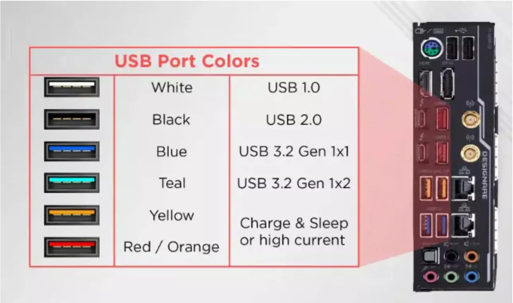

# USB (Universal Serial Bus)
***
Uno standard industriale di connessione, permette di collegare diversi dispositivi elettronici.

#### **Tipi di connettori USB**
[Parlando della forma del connettore](https://www.youtube.com/watch?v=tszcK7f2D0g), ce ne sono un paio:

- **USB-A**: classico connettore USB rettangolare che troveresti sulle porte del computer.
  
- **USB-B**: forma quadrata con angoli smussati, tipico di stampanti e scanner.
  
- **Micro USB-B**: schiacciata e a forma di trapezio, si usa su dispositivi mobili meno recenti.

- **USB Mini-B:** più piccola rispetto all'USB-B, si usa su vecchie fotocamere o lettori MP3.

- **USB-C**: simmetrica e tondeggiante, più recente.

### I ruoli nella comunicazione USB
La connessione USB segue una sua gerarchia:

- il dispositivo USB riceve informazioni dall'host al quale è collegato, es. un mouse riceve informazioni dal tuo PC.

- la parte di connettore rivolta all'host è USB-A, è quello che colleghi alla porta fisica del PC.

- la parte di connettore rivolta al dispositivo è USB-B; non è detto abbia sempre un connettore rimovibile, nel caso di un mouse lo trovi saldato all'interno del mouse stesso.

- il connettore USB-A trasmette dati, il connettore USB-B li riceve; non succede il contrario.

- il connettore USB-C abbandona questo schema, entrambi i lati hanno la stessa forma e sono i dispositivi stessi a negoziare il ruolo host o ricevente.

### Come trasmette dati l'USB?
Leggi questi due articoli: [[Controller USB]] e [[Root hub]].

#### **Versioni di USB**
Qui si parla invece dello standard tecnologico implementato su connettore:

- **USB 1.0 e USB 1.1**: le prime due versioni di USB, con rispettive velocità di 1.5 Mbps e 12 Mbps; si usavano soprattutto per tastiere e mouse.
  
- **USB 2.0**: fino a 480 Mbps di velocità nel trasferimento dati; usato per hardisk esterni, stampanti, webcam e dispositivi di vario tipo.
  
- **USB 3.0:** velocità di trasferimento dati a 5 Gbps, ha avuto qualche problema di compatibilità con alcuni dispositivi (è comunque retrocompatibile con USB 2.0).
  
-  **USB 3.1 (Gen 1 e Gen 2)**: la Gen 1 è stata come una sorta di 'fix' per i problemi di compatibilità dell'USB 3.0, velocità trasferimento rispettive di 5 Gbps e 10 Gbps.
  
- **USB 3.2**: questo standard supporta il connettore USB-C, velocità di trasferimento dati fino a 20 Gbps.
  
- **USB 4.0**: velocità trasferimento dati fino a 40 Gbps, introdotto nel 2019.

Ricorda che ad avere l'ultima parola sulla velocità di trasferimento dati che ottieni da un connettore USB è la sua porta, se connetti un USB 3.1 a una porta usb 1.0 riuscirai a traferire dati a una velocità massima di 1.5 Mbps.

### I colori dei connettori USB
Ogni connettore USB ha un suo colore, può aiutare a riconoscere al volo lo standard USB utilizzato da quel cavo. Alcuni colori variano leggermente, dipende anche dal tipo di scheda madre che utilizzi:

---
[[Controller USB]]
[[Root hub]]