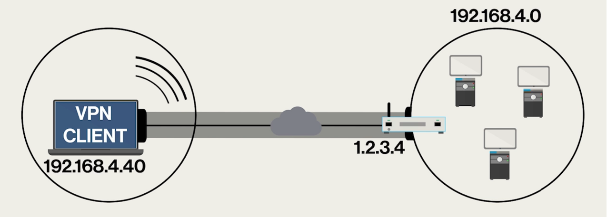

# VPN (Virtual Private Network)
---
Una tecnologia che crea un tunnel di traffico crittografato tra client e un'altra rete, creando quindi una rete privata.

### Come funziona?
Immagina di essere in aeroporto dall'altra parte del mondo, ma di voler accedere alle cartelle di rete del tuo ufficio; quello che un client VPN fa è raggiungere l'IP pubblico del [[Router]] di quella rete e poi creare un tunnel crittografato dal quale far passare il traffico.

Questo tipo di processo ti permette di raggiungere le risorse di quella [[LAN (Local Area Network)]] nonostante tu non ci sia fisicamente connesso tramite cavo.

Connettersi a una VPN crea addirittura una scheda di rete virtuale sul tuo PC; se ti trovi dall'altra parte del mondo avrai un certo [[Indirizzo IP (Internet Protocol)]], ma unendoti alla VPN ti verrà assegnato un indirizzo IP esattamente come succederebbe in quella LAN. Proprio perchè adesso hai una scheda di rete virtuale, puoi accederci da pannello di controllo e modificarla come faresti con una scheda di rete fisica: vuoi ricevere un indirizzo in DHCP? vuoi fissarne uno manuale? apri il pannello e cambia quello che ti serve.

Esistono tanti tipi di client VPN, Windows ne ha uno molto basilare. Esistono anche tanti tipi di protocolli VPN: OpenVPN, WireGuard, IPsec (con IKEv2 o L2TP), e PPTP.

### Perché è utile usarlo?
Protegge la tua privacy; sostituisce il tuo indirizzo IP con quello del server VPN, oltre questo nasconde tutto il traffico che passa tra te e il server, tramite la [[Crittografia]].
  
### In che modo è diverso da un proxy?
Una VPN è diversa da un [[Proxy]], nonostante entrambi facciano da intermediario tra te e [[Internet]]:

| Caratteristica | VPN | Proxy |
|---|---|---|
| Crittografia | Crittografa tutto il traffico | Non crittografa i dati (salvo alcuni proxy HTTPS) |
| Copertura | Protegge tutto il traffico di rete | Funziona solo per le app configurate (es. browser) |
| Sicurezza | Offre maggiore protezione su reti pubbliche | Meno sicuro, non protegge dai rischi di rete |
| Velocità | Più lenta per via della crittografia | Più veloce, ma senza protezione dati |
| Utilizzo tipico | Privacy, sicurezza e accesso remoto | Navigazione anonima e bypass di blocchi web |

Una VPN è ideale per proteggere totalmente la tua connessione con un tunnel, mentre un proxy è utile per navigare con IP diverso in modo semplice e veloce.  Le due cose hanno anche costi diversi, ne sai poco adesso e se vuoi puoi informarti. Comunque può capitare che un'azienda usi entrambi le tecnologie: proxy per ottimizzazione e filtro, VPN per sicurezza e connessioni remote alla rete aziendale.

---
[[Crittografia]]