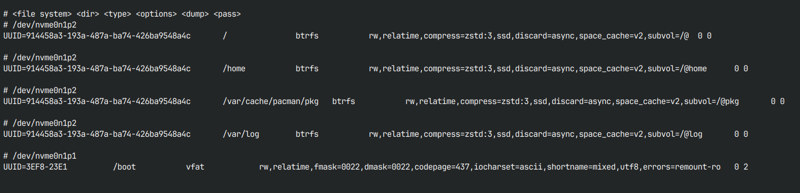

# fstab (File System Table)
---
Un file di configurazione di sistema in [[Linux]], dentro ci tiene scritto quali [[Filesystem]] esistono, dove devono essere montati e con quali regole, in modo permanente.

Si trova in `etc/fstab` e assomiglia a questo:



### Come funziona?
Funziona che ogni riga dà delle istruzioni al sistema in questo modo:

```
# <file system> <dir> <type> <options> <dump> <pass>
```

Seguendo questa legenda qui:

- **file system:** indica l'UUID del filesystem selezionato.
- **dir:** la directory dove montare il filesystem.
- **type:** il tipo di filesystem.
- **options:** una serie di regole scelte.
- **dump:** backup
- **pass:** controllo filesystem all'avvio

Le righe commentate con # sono solo dei commenti umani, li inserisce Linux per farti capire a quale partizione corrisponde quale UUID.

Per fare un esempio:

```
UUID=914458a3-193a-487a-ba74-426ba9548a4c   /   btrfs   rw,relatime,compress=zstd:3,ssd,discard=async,space_cache=v2,subvol=/@   0 0

```

diventa:

> “Il filesystem con questo UUID  
> è il filesystem principale `/`  
> usa btrfs  
> è scrivibile  
> usa compressione zstd  
> è su SSD  
> usa il sottovolume `@`”

