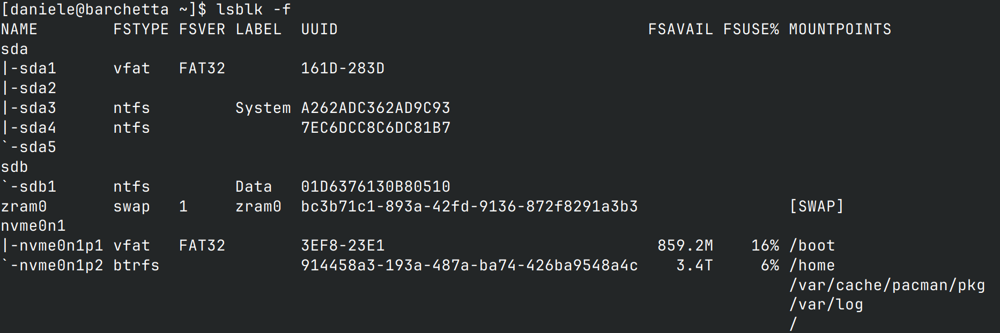

# lsblk (List Block Devices)
---
Una utility di sistema in [[Linux]], il nome è ricavato da "list block devices". E

Quello che fa è elencare [[Dispositivi a blocchi]] e visualizzarne varie proprietà; non ne mostra i dati.

### Come funziona `lsblk`?
Risponde alla domanda "Che dispositivi a blocchi esistono?"

Se lanci `lsblk` vedi qualcosa tipo questo:

```
NAME   MAJ:MIN RM  SIZE RO TYPE MOUNTPOINTS
sda      8:0    0  465G  0 disk
├─sda1   8:1    0  260M  0 part /boot/efi
├─sda2   8:2    0  128M  0 part
└─sda3   8:3    0  465G  0 part /
```

In questo output ci vedi un paio di colonne interessanti:

- **NAME:** il nome del dispositivo, e sotto ci trovi nidificate le sue partizioni; "sda3" è la terza partizione del dispositivo "sda".
  
- **RM:** sta per "removable" e indica se il disco è rimovibile secondo il kernel; lo zero è un no, mentre l'uno è un sì. Non è sempre attendibile al 100% perchè una USB potrebbe essere classificata come non rimovibile.
  
- **SIZE:** la dimensione del disco in fattore binario, non quella commerciale (vedi [[Byte]]).

- **RO:** sta per "read-only" e se sta a zero vuol dire che è scrivibile, se sta a uno vuol dire che è in sola lettura.
  
- **TYPE:** indica il tipo di oggetto, può essere un disco, una partizione o altro ancora.

- **MOUNTPOINTS:** il percorso dove è stato montato quel dispositivo (vedi [[Mount points in Linux]]).

### Come funziona `lsblk -f`?
Risponde alla domanda "Che filesystem ci sono sopra i miei dispositivi a blocchi?"

Il flag -f sta per "filesystem". Guarda questo:



Ecco, questo comando riprende alcune proprietà da lsblk e ci aggiunge altre, eccole:

- **FSTYPE:** il tipo di [[Filesystem]].
- **FSVER:** la versione del filesystem.
- **LABEL:** il nome umano che hai dato al dispositivo, qualcosa tipo "Gaming" o "Pippo".
- **UUID:** leggi [[UUID (Universally Unique ID)]].
- **FSAVAIL:** sta per "File System Available".
- **FSUSE%:** sta per "File System Use".
- **MOUNTPOINTS:** vedi paragrafo prima.

---
- [[Mount points in Linux]]